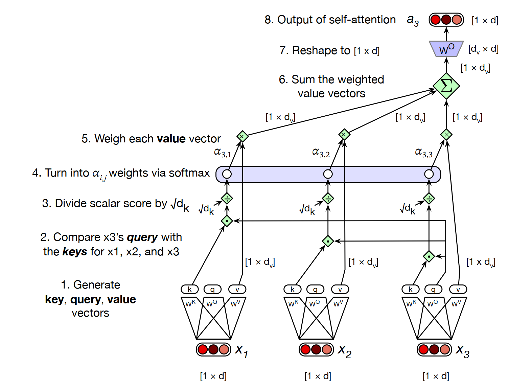
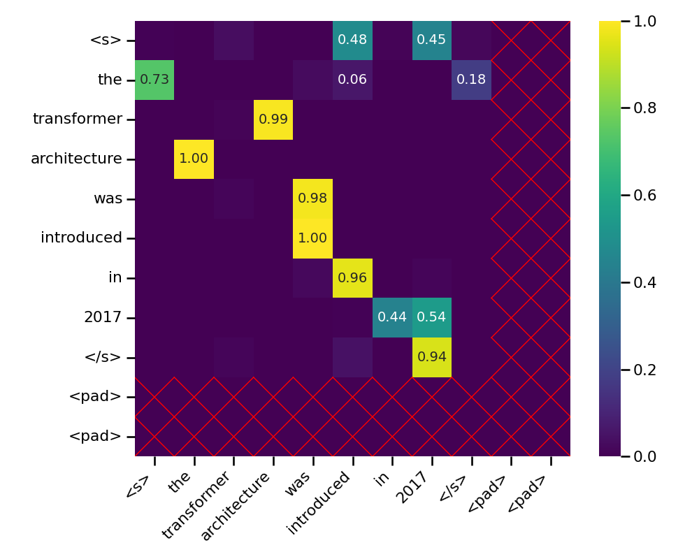
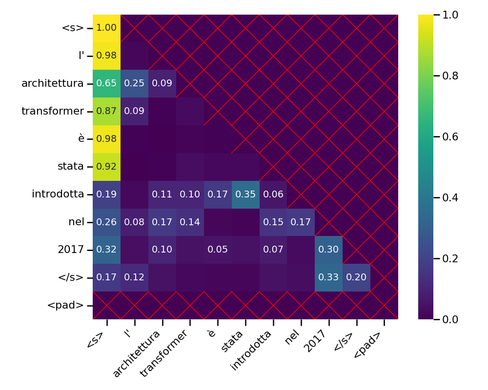
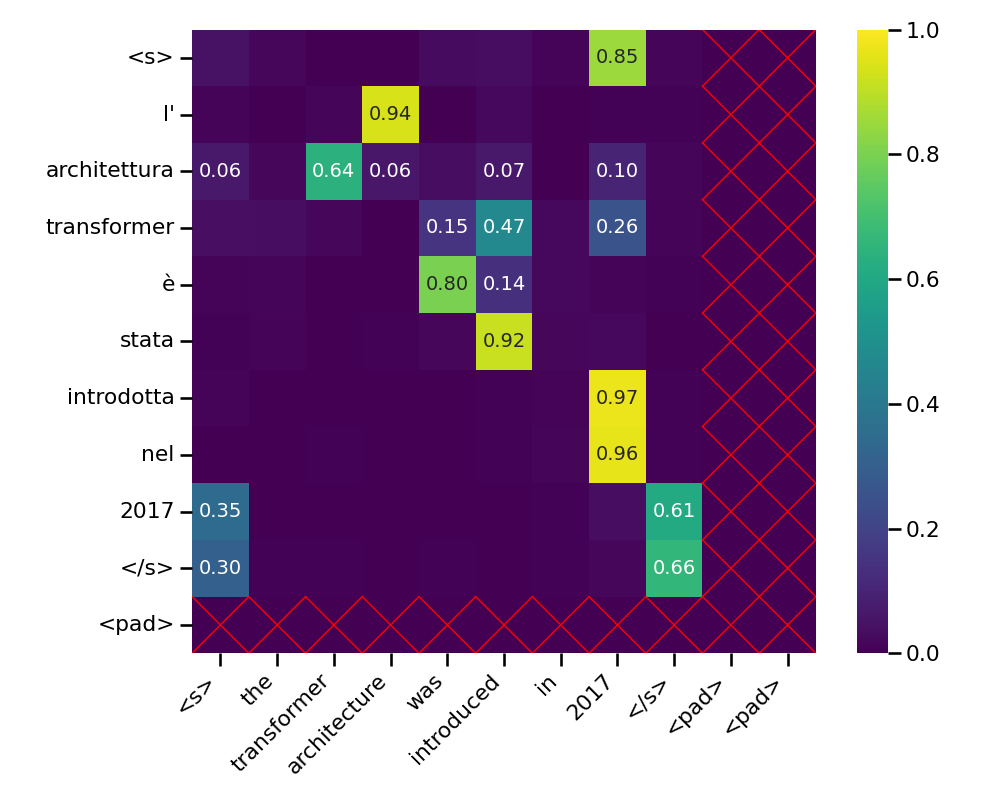

# The Attention Mechanism

At the core of the Transformer lies the attention mechanism, which allows the model to dynamically focus on different parts of the input when processing each element. To understand how this works, it is necessary to explore both the intuition behind it and the specific mathematical formulation used in this implementation.

Consider the translation of the English sentence _"The transformer architecture was introduced in 2017"_ into Italian: _"L'architettura transformer è stata introdotta nel 2017"_. When translating the word _"introduced"_ to _"introdotta"_, the surrounding context must be examined to determine the correct gender agreement. Attention is paid to _"architecture"_ to determine that the past participle should be feminine (_"introdotta"_), and moderate attention to _"transformer"_ to understand what kind of architecture is being discussed. This selective focus is exactly what attention mechanisms formalize.

This mechanism is implemented through a retrieval system structured around **queries**, **keys**, and **values**. In this framework, the model processes each word by generating a **query** $q$, which represents the specific information it currently needs to resolve, such as the grammatical dependencies or semantic attributes of the word. It is also referred to as the **focus of attention**. Simultaneously, every word in the input sequence provides a **key** $k$ that serves as a descriptive index or metadata, identifying the type of information it contains. By computing the compatibility between the query of the target word and the keys of all other words, the system determines a relevance weight for each word in the sequence, called **attention weights**. These weights are then applied to the **values** $v$, which hold the actual latent representations of the words. The final output is a weighted sum of these values, effectively filtering the sequence to extract only the most relevant informational content for the current processing step.

## Scaled Dot-Product Attention

The **scaled dot-product attention** is the variant employed in _Attention Is All You Need_[^1].

For a specific input vector $x_i \in \mathbb{R}^{d_{model}}$, three unique representations are generated: a **query** $q_i \in \mathbb{R}^{d_{k}}$, a **key** $k_i \in \mathbb{R}^{d_{k}}$, and a **value** $v_i \in \mathbb{R}^{d_{v}}$. These are obtained by projecting $x_i$ using learned weight matrices:

$$
q_i = x_i W^Q  \quad\quad k_i = x_i W^K  \quad\quad  v_i = x_i W^V
$$

with $W^Q \in \mathbb{R}^{d_{model},d_k}$, $W^K \in \mathbb{R}^{d_{model},d_k}$ and $W^V \in \mathbb{R}^{d_{model},d_v}$. In this project $d_k = d_v$ for simplicity.

To determine how much the element $i$ should attend to another element $j$, a **similarity score** is calculated by taking the dot product between the query $q_i$ and the key $k_j$.

However, as the dimension of the vectors $d_{k}$ increases, the dot products can grow quite large. This magnitude can push the softmax function into regions with extremely small gradients, obstructing the training process. To mitigate this, the scores are scaled by dividing by $\sqrt{d_{k}}$.

The attention weights $\alpha_{ij}$ are obtained by applying the **softmax** function to these scaled scores across all possible keys $j$:

$$
\alpha_{ij} = \frac{\exp(q_i \cdot k_j / \sqrt{d_k})}{\sum_{l} \exp(q_i \cdot k_l / \sqrt{d_k})}
$$

This operation is fundamental for three main reasons:

1. **Normalization**: It transforms raw similarity scores into a probability distribution that sums to 1. This ensures that the attention output is a stable weighted average of the values, preventing the output magnitudes from exploding.
2. **Focus**: The exponential nature of the softmax function sharpens the distribution, effectively focusing on the most relevant elements while suppressing less important ones.
3. **Differentiability**: It is differentiable, allowing the model to learn through gradient descent.

These weights represent the relative importance of each value $v_j$ for the current query $q_i$. The attention output $z_i$ is then computed as the weighted sum of all values:

$$
z_i = \sum_{j} \alpha_{ij} v_j
$$

Finally, an output projection matrix $W^O \in \mathbb{R}^{d_v, d_{model}}$ is applied to $z_i$ to project it back to the original model dimension $d_{model}$:

$$
\text{a}_i = z_i W^O
$$

{ loading=lazy }
/// figure-caption
The attention process to calculate the attention output of the input sequence's third element[^2]. Note that here $d_{model}$ is referred to as $d$.
///

In practice, computing attention for each vector individually cannot be done in parallel. To take advantage of parallelization, all input vectors in a sequence are grouped into a matrix $X \in \mathbb{R}^{S,d_{model}}$. The projections are then performed simultaneously for the entire sequence:

$$
Q = X W^Q  \quad\quad K = X W^K  \quad\quad  V = X W^V
$$

with $Q \in \mathbb{R}^{S,d_k}$, $K \in \mathbb{R}^{S,d_k}$ and $V \in \mathbb{R}^{S,d_v}$.

By representing the queries, keys, and values as matrices ($Q, K, V$), the attention for the entire sequence can be computed using a single set of matrix operations. This **matricial implementation** allow to parallelize the scoring and weighting process across all positions at once.

The formulation for the scaled dot-product attention in matricial form is:

$$
Attention(Q, K, V) = softmax\left(\frac{QK^T}{\sqrt{d_{k}}}\right)V
$$

After computing the scores and applying the scaling factor, the **softmax** function is applied row-wise. These weights are then used to compute a weighted sum of the values $V$. Finally, similar to the single-vector case, the output is projected using $W^O$.

## Multi-Head Attention

What presented in the previous section can be referred to as single-head attention. Although it is a powerful operation, the Transformer architecture employs the **multi-head attention**. The intuition is that different aspects of the relationship between words might be important in different contexts. One attention head might focus on syntactic relationships (like subject-verb agreement), while another focuses on semantic coreference.

Rather than computing attention once globally, the $Q, K$, and $V$ matrices are projected into $A$ different lower-dimensional spaces (each of dimension $d_{head}$) and $A$ parallel attention operations are computed.

$$
\text{MultiHeadAttention}(Q, K, V) = \text{Concat}(head_1, head_2, ..., head_A) W^O
$$

where each head is: $\quad head_i = Attention(QW_i^Q, KW_i^K, VW_i^V)$

An important detail in this project is the handling of the model dimension $d_{model}$. Standard Transformers often require $d_{model}$ to be divisible by the number of heads. However, to support pretrained embeddings like GloVe (which come in fixed sizes: 50, 100, 200 and 300), the code relaxes this constraint. It projects the input $X$ to spaces of dimensions $d_{model} \times A * d_{head}$[^3] and uses an output projection matrix $W^O \in \mathbb{R}^{A * d_{head}, d_{model}}$ to map the concatenated results back to the original $d_{model}$, ensuring mathematical consistency regardless of the input size.

## Attention Types and Masking Strategies

Before discussing specific masking strategies, the concept of **padding** must be addressed. For the model to process multiple sequences in parallel (batches), all sequences within a batch must have the same length. Since natural language sentences vary in size, they are standardized by appending special `<PAD>` tokens until they reach a uniform length. However, these tokens do not carry semantic meaning and should not contribute to the attention scores or the final weighted sum. Masking is the mechanism used to ensure that the model ignores these tokens, preventing them from influencing the representation of valid words.

Proper masking is critical for Transformer functionality. Masks are implemented as matrix operations that selectively block information flow between tokens by setting certain attention scores to $-\infty$ before the softmax operation.

### Encoder Self-Attention

In the encoder, tokens should attend to all other non-padding tokens in the sequence.

{ loading=lazy }
/// figure-caption
Encoder attention weights illustrating how all non-padding tokens can interact.
///

A position $(i, j)$ in the **padding mask** is "True" only if both tokens $i$ and $j$ are not padding. This ensures that the model never looks at padding tokens nor allows padding tokens to influence others.

In this scenario, it is important to note that the encoder attention is **bidirectional**, since the architecture assumes the source sequence to be entirely available at the start.

### Decoder Causal Attention

The decoder uses a special masking strategy to maintain the auto-regressive property: when predicting the next word, it should only look at past words, never at future ones.

{ loading=lazy }
/// figure-caption
Causal attention weights showing the lower-triangular structure.
///

This is achieved by applying a **causal mask**, which is a lower-triangular matrix. In this implementation, this is combined with the padding mask using a logical AND operation. This mask ensures a token at position $i$ can only attend to positions $j \le i$ that are also not padding.

### Decoder Cross-Attention

In cross-attention, the **queries** come from the target sequence (the decoder), while the **keys** and **values** come from the source sequence representation (the encoder output).

{ loading=lazy }
/// figure-caption
Cross attention weights showing target-to-source relevance.
///

The masking strategy here ensures that target tokens do not attend to source padding tokens. Note that the number of rows in the attention matrix is determined by the query (target sequence length), while the number of columns is determined by the key (source sequence length). This allows the decoder to pick relevant information from the encoded source sentence at each step of the translation.

[^1]: Vaswani, A., Shazeer, N., Parmar, N., Uszkoreit, J., Jones, L., Gomez, A., Kaiser, L. \& Polosukhin, I. Attention Is All You Need.  (2017), <https://arxiv.org/abs/1706.03762>

[^2]: Jurafsky, D. \& Martin, J. Speech and Language Processing: An Introduction to Natural Language Processing, Computational Linguistics, and Speech Recognition, with Language Models.  (2025), <https://web.stanford.edu/~jurafsky/slp3/>

[^3]: Consider the following design choice has been made for simplicity: $d_k = d_v = d_{head}$, so the matrices $Q$, $K$ and $V$ have the same dimensions.
