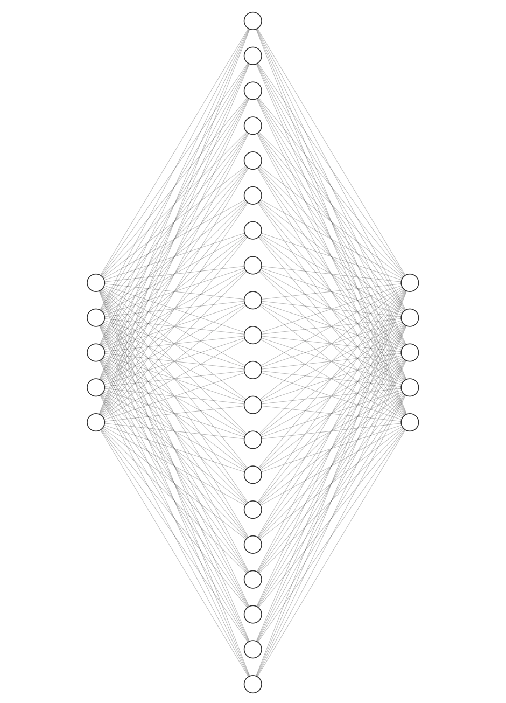
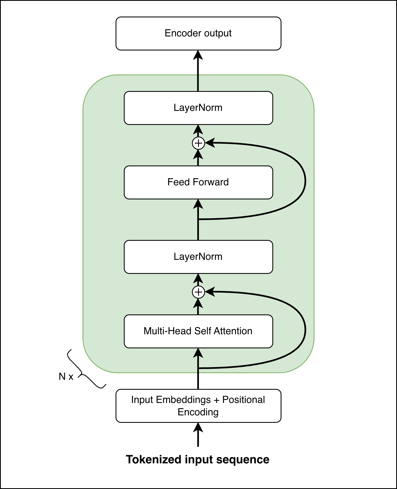
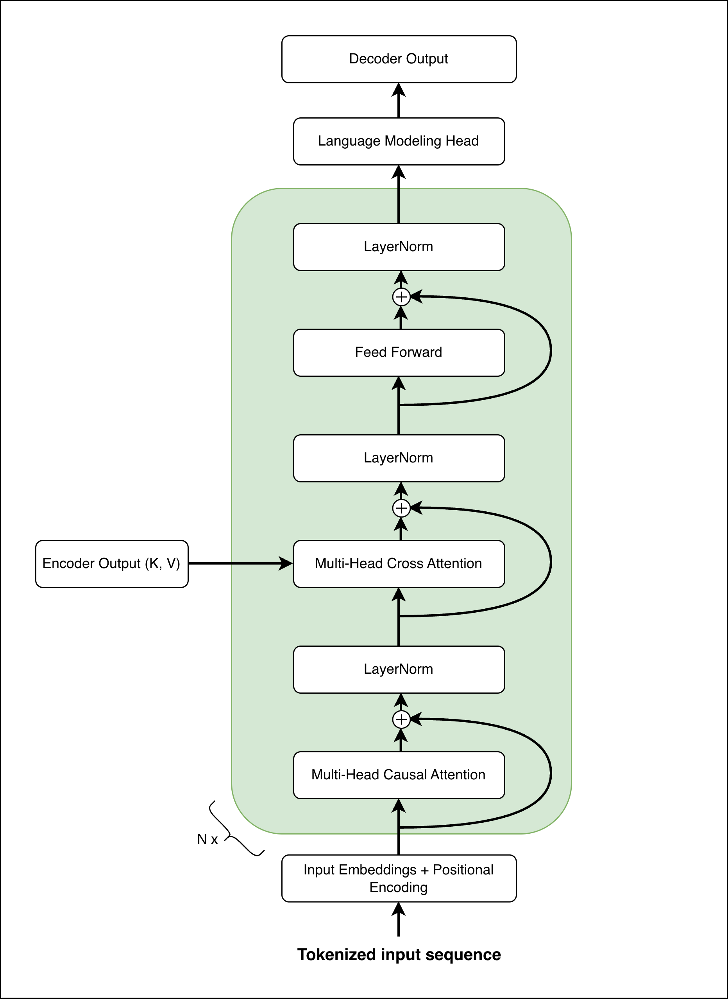

# The Encoder and Decoder Networks

While attention captures relational context between tokens, the Transformer also relies on a Feed Forward Network to independently transform each token's representation through non-linear mappings. These two components are then modularly stacked and interconnected to form the Encoder and Decoder networks.

## Feed Forward Network

While the attention mechanism captures relational context between tokens, the Feed Forward Network processes each one independently. Crucially, the FFN is **positionwise**: the same network is applied to each token separately and identically. This means that every token's representation is transformed by the exact same learned function, with no interaction between positions at this stage. As highlighted in recent research[^1], these layers are not just auxiliary components but are critical for the model's overall predictive power and depth efficiency.

The FFN acts as a **universal function approximator**, introducing the non-linear transformations necessary to learn complex mappings that linear attention alone cannot capture. By mapping contextualized representations into a higher-dimensional space, it transforms aggregated information from the attention layers into **abstract concepts**. Furthermore, these layers hold the majority of the model's trainable parameters, serving as the primary source of model capacity.

The original paper[^2] used 2 layers that map a vector $x$ from $R^{d_{model}}$ to $R^{4*d_{model}}$ and then back to $R^{d_{model}}$.

{ loading=lazy .img-small}
/// figure-caption
The Feed Forward Network considering $d_{model} = 5$ and $\text{hidden dimension} = 4*d_{model}$.
///

## The Encoder Stack

The encoding component is built as a stack of $N$ identical layers, where the output of one encoder, called *hidden state*, becomes the input for the next. Within each layer, data traverses two primary components. The sequence first enters a self attention mechanism that establishes contextual dependencies between tokens, allowing the model to understand how different parts of the sequence relate to one another. Subsequently, the contextualized representations flow through the Feed Forward Network, which independently transforms each token in parallel.

{ loading=lazy .img-medium}
/// figure-caption
The encoder network architecture.
///

All encoder layers share the same structure but do not share weights, each possesses its own set of parameters. The same goes for the decoder layers.

## The Decoder Stack

The decoding component mirrors the encoder's stack structure with $N$ layers but is designed to generate the target sequence autoregressively. As data moves up through the decoder stack, it passes through specialized attention layers: a masked self attention layer ensures that predictions for a specific position can only depend on known preceding tokens, effectively blocking information from the future; a cross attention layer bridges the two stacks, enabling the decoder to focus on relevant segments of the source input derived from the encoder's output. The output of the final decoder layer is then projected to produce the next token in the sequence.

{ loading=lazy .img-medium}
/// figure-caption
The decoder network architecture.
///

Like the encoder, the decoder utilizes residual connections and normalization, as detailed in the [Enhancements and Model Sizing](enhancements_and_sizing.md) chapter.

## The Forward Pass

In order to fully process a source and a target sequences, the following steps happen:

1. **Encoding**: The source sequence is embedded, position-encoded, and passed through the encoder stack to produce a final set of contextual embeddings, the *encoder output*.
2. **Decoding**: The target sequence is processed through the decoder. At each step, the cross attention layers bridge the two languages by allowing the decoder to query the encoder's representations.
3. **Prediction**: The final decoder output is projected to vocabulary-sized logits via the Language Modeling Head, representing the probability distribution for the next token in the sequence.

[^1]: Gerber, I. Attention Is Not All You Need: The Importance of Feed forward Networks in Transformer Models.  (2025), <https://arxiv.org/abs/2505.06633>

[^2]: Vaswani, A., Shazeer, N., Parmar, N., Uszkoreit, J., Jones, L., Gomez, A., Kaiser, L. \& Polosukhin, I. Attention Is All You Need.  (2017), <https://arxiv.org/abs/1706.03762>
