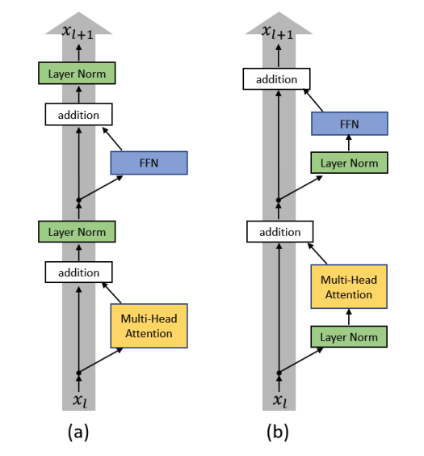
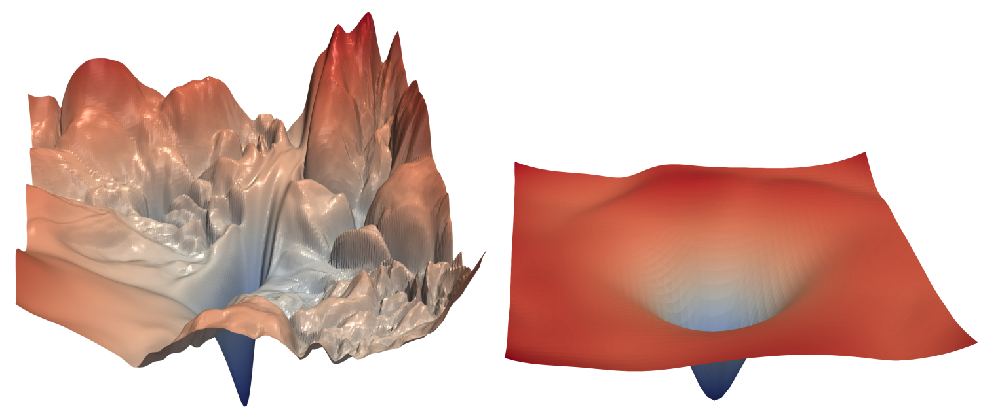

Throughout both encoder and decoder, two techniques are critical for training stability: layer normalization and residual connections.

## Layer Normalization

Normalization strategies are fundamental in training deep neural networks to mitigate the **internal covariate shift**, where the distribution of each layer's activations changes in the course of training[^1]. By ensuring that activations maintain a consistent mean and variance, normalization prevents gradients from vanishing or exploding, smooths the loss landscape and allows for the use of higher learning rates.

Layer normalization[^2] was specifically introduced to overcome the limitations of Batch Normalization, which is sensitive to mini-batch size and difficult to apply to sequence models where input lengths vary. Unlike Batch Normalization, which computes statistics across the batch dimension, Layer Normalization normalizes activations across the feature dimension for each example independently. This ensures identical computation during both training and inference, providing greater stability for the hidden state dynamics within the Transformer architecture.

It normalizes activations across the feature dimension for each example and position independently. For a vector $x \in \mathbb{R}^{d_{model}}$:

$$
\text{LayerNorm}(x) = \gamma * \frac{(x - \mu)}{\sqrt{\sigma^2 + \epsilon}} + \beta
$$

where $\mu$ and $\sigma^2$ are the mean and variance of $x$ across the feature dimension, $\gamma$ and $\beta$ are the learned scale and shift parameters and $\epsilon$ is a small constant added to avoid division by zero.

Layer normalization stabilizes the hidden state dynamics and provides two invariance properties: **activations re-scaling**, invariance to re-scaling the entire weight matrix or the input, and **activations re-centering**, invariance to shifting all incoming weights by a constant.

### Positioning of Layer Normalization

The placement of layer normalization within the Transformer block has significant impact on training stability and final performance. Two main configurations are commonly used:

- **Post norm**: The original Transformer setting where normalization is applied after the residual connection. While it typically achieves better performance on Machine Translation tasks[^3], it's harder to optimize and requires a learning rate warm-up stage to prevent large gradients at initialization[^4].
- **Pre norm**: Normalization is applied before each sub-layer. This configuration is widely adopted in modern models because it's much more stable, allowing for faster convergence and often eliminating the need for complex warm-up schedules[^4]. However, it may be more prone to overfitting in certain scenarios like zero-shot translation[^3].

{ loading=lazy .img-medium }
/// figure-caption
Post norm (left) and pre norm (right) architectures[^4].
///

## Residual Connections

The residual connection, introduced in ResNets[^5], is a fundamental building block where the input of a sub-layer is added to its output (residual stream concept). As illustrated in the Post norm (left) configuration of the previous figure, a sub-layer (such as Multi-Head Attention or FFN) represents the function $F$ in the following formulation, so, instead of computing $y = F(x)$, the operation $y = x + F(x)$ is performed.

This formulation effectively reformulates layers as learning residual functions $F(x) := H(x) - x$ with reference to the layer inputs, rather than learning unreferenced functions. This has profound implications for gradient flow. During backpropagation, gradients can flow directly through the residual connections without passing through the sub-layer operations. This creates a "gradient highway" that allows effective training of very deep networks.

Residual connections also provide an inductive bias: they allow each layer to learn refinements to the representation rather than complete transformations. If a layer's transformation isn't helpful, it can learn to approximate zero, effectively skipping that layer for certain inputs.

The inclusion of residual connections significantly smooths the loss landscape, making the objective function easier to optimize. As visualized below, skip connections prevent the loss surface from becoming highly chaotic as network depth increases.

{ loading=lazy .img-large }

/// figure-caption
Loss surfaces of ResNet-56 without skip connections (left) and with skip connections (right)[^6].
///

## Model sizes

The architecture supports several hyperparameter configurations, enabling the model to scale from a minimal _Nano_ version to the _Original_ Transformer specification[^7].

A primary design objective for the custom configurations, _Nano_, _Small_, and _Base_) is the integration of pretrained GloVe embeddings. To ensure compatibility, the model dimension $d_{model}$ is fixed to match the choosen GloVe vector sizes: 50, 100, and 300[^8]. In the original Transformer paper, the dimension of the feed forward hidden layer $d_{ff}$ is four times the model dimension $d_{model}$. This proportional scaling is maintained in the _Nano_ and _Small_ configurations. The _Base_ configuration, however, is an exception; while the standard ratio would imply $d_{ff} = 1200$, it has been restricted to 800 to avoid excessive memory usage and training time.

The _Original_ configuration corresponds to the parameters from the base Transformer model in the original paper and is included primarily for comparative purposes. Due to limitations in computational resources and time, only the _Small_ configuration was selected for training and evaluation.

The following table summarizes the model's hyperparameter configurations available in the [`config.yml`](https://github.com/Giovo17/tfs-mt/blob/main/src/tfs_mt/configs/config.yml) file:

| Parameter          | Nano     | Small    | Base     | Original |
|:------------------ |:-------- |:-------- |:-------- |:-------- |
| **Encoder Layers** | 4        | 6        | 8        | 6        |
| **Decoder Layers** | 4        | 6        | 8        | 6        |
| **d_model**        | 50       | 100      | 300      | 512      |
| **Num Heads**      | 4        | 6        | 8        | 8        |
| **d_ff**           | 200      | 400      | 800      | 2048     |
| **Norm Type**      | PostNorm | PostNorm | PostNorm | PostNorm |
| **Dropout**        | 0.1      | 0.1      | 0.1      | 0.1      |
| **GloVe Dim**      | 50d      | 100d     | 300d     | -        |

[^1]: Ioffe, S. \& Szegedy, C. Batch Normalization: Accelerating Deep Network Training by Reducing Internal Covariate Shift.  (2015), <https://arxiv.org/abs/1502.03167>

[^2]: Ba, J., Kiros, J. \& Hinton, G. Layer Normalization.  (2016), <https://arxiv.org/abs/1607.06450>

[^3]: Mao, Z., Dabre, R., Liu, Q., Song, H., Chu, C. \& Kurohashi, S. Exploring the Impact of Layer Normalization for Zero-shot Neural Machine Translation.  (2023), <https://arxiv.org/abs/2305.09312>

[^4]: Xiong, R., Yang, Y., He, D., Zheng, K., Zheng, S., Xing, C., Zhang, H., Lan, Y., Wang, L. \& Liu, T. On Layer Normalization in the Transformer Architecture.  (2020), <https://arxiv.org/abs/2002.04745>

[^5]: He, K., Zhang, X., Ren, S. \& Sun, J. Deep Residual Learning for Image Recognition.  (2015), <https://arxiv.org/abs/1512.03385>

[^6]: Li, H., Xu, Z., Taylor, G., Studer, C. \& Goldstein, T. Visualizing the Loss Landscape of Neural Nets.  (2018), <https://arxiv.org/abs/1712.09913>

[^7]: Vaswani, A., Shazeer, N., Parmar, N., Uszkoreit, J., Jones, L., Gomez, A., Kaiser, L. \& Polosukhin, I. Attention Is All You Need.  (2017), <https://arxiv.org/abs/1706.03762>

[^8]: GloVe reference website: <https://nlp.stanford.edu/projects/glove/>
