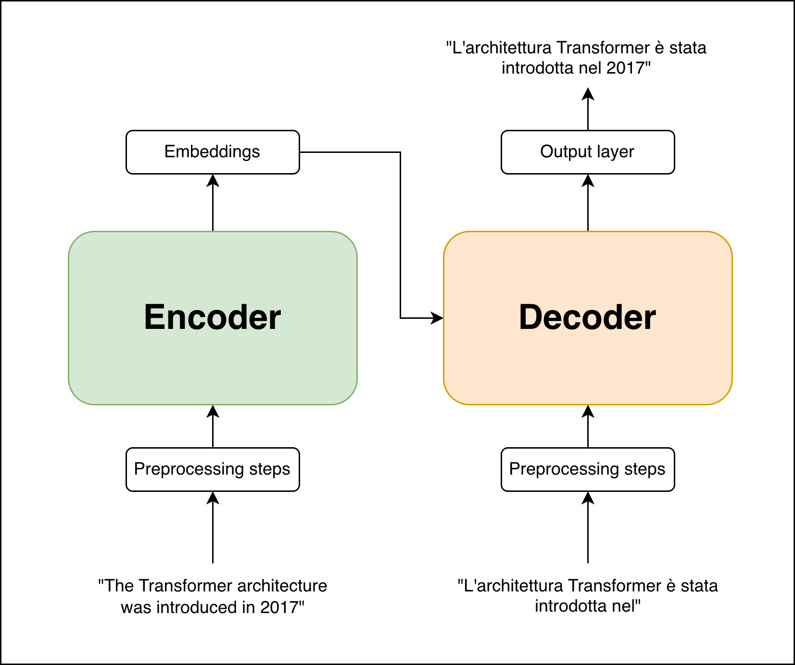

# The Transformer architecture

> **Disclaimer**
>
> This Transformer implementation misses a lot of architectural improvements that have been developed since the first paper release in 2017. It's main purpose is to show off the architecture design and training/inference methods as a learning project.

Originally introduced in the paper _Attention Is All You Need_[^1], the Transformer has since become the predominant sequence modeling architecture underlying modern foundation models. These models marked a major change in the AI landscape: by training with self-supervised objectives on massive datasets (over 20 trillion tokens, a corpus equivalent to ~40 million books or ~200 billion web pages) and scaling the model size, they learn rich representations of language and emergent abilities[^2].

This made Transformer-based models to be widely employed in and adapted to a plethora of domains and tasks, from coding to image generation, from protein structure prediction to scientific discovery, from language models to robotics. Its role is no longer just a model for sequence modeling, but it is the current main architecture driving the golden age of **Artificial Intelligence**.

The primary objective of this project is to provide a comprehensive show-off of the **Transformer architecture** concepts and implementation.

## Introduction

The Transformer architecture is designed from the ground up for **sequence modeling**, addressing the challenge of learning dependencies among elements in sequences such as natural language, audio, and time series data. At its core, the Transformer models sequences through **self-attention**, a mechanism that constructs contextual representations by allowing each token to attend to and integrate information from all other tokens in the sequence. Through this process, the model learns how tokens relate to one another across both local and long-range contexts, enabling effective modeling of dependencies over large spans.

This approach stands in contrast to earlier paradigms of sequence modeling that relied heavily on architectural inductive biases. **Recurrent Neural Networks (RNNs)** process sequences sequentially, which limits parallelization and often leads to difficulties in modeling long-range dependencies due to vanishing or exploding gradients. **Convolutional Neural Networks (CNNs)**, while more parallelizable, require deep hierarchies or large receptive fields to effectively capture global context. By eliminating both recurrence and convolution in favor of attention-based interactions, the Transformer achieves higher parallelization during training while offering a direct mechanism for modeling long-range dependencies.

The first proposed workflow of a Transformer-based model follows the **encoder–decoder** paradigm and it has been employed for **Machine Translation**. The encoder maps a source sequence into a set of high-dimensional contextual embeddings using stacked self-attention and feed-forward layers. The decoder then generates the target sequence autoregressively, conditioning each output element on both the encoder representations and previously generated tokens.

{ loading=lazy }
/// figure-caption
Overall architecture schema.
///

For the purpose of this work, the Machine Translation task has been chosen.

This document is organized to provide a detailed walkthrough of the Transformer components and architecture:

-   **The Attention Mechanism**: Provides an explanation on the how the different attention and masking mechanisms work.
-   **Embeddings**: Explores how input tokens are transformed into continuous vectors and how positional information is injected into the model.
-   **Encoder and Decoder**: Describes how attention layers and feed-forward networks are stacked to build the full architecture.
-   **Enhancements and Sizing**: Discusses architectural stability improvement techniques and provides details on different model configurations employed in the project.
-   **Conclusions**: Discusses learned lessons and mentions several modern architectural paradigms.

[^1]: Vaswani, Ashish, Noam Shazeer, Niki Parmar, et al. 2017. *Attention Is
All You Need*. <https://arxiv.org/abs/1706.03762>.

[^2]: Wei, J., Tay, Y., Bommasani, R., Raffel, C., Zoph, B., Borgeaud, S., Yogatama, D., Bosma, M., Zhou, D., Metzler, D., Chi, E. H., Hashimoto, T., Vinyals, O., Liang, P., Dean, J., & Fedus, W. (2022). Emergent Abilities of Large Language Models. <https://arxiv.org/abs/2206.07682>
