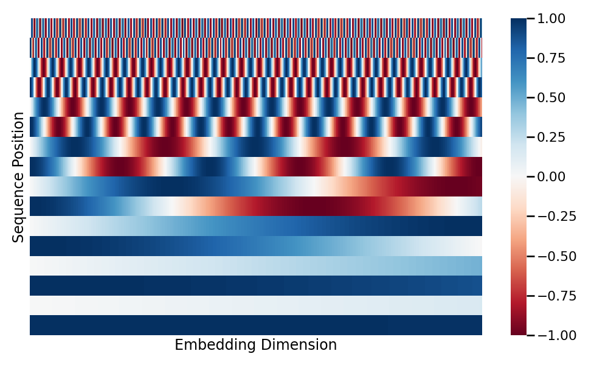
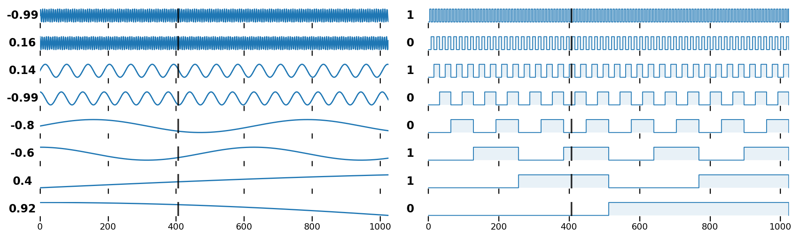

# Tokenization and Embeddings

In the Transformer architecture, the process of transforming raw text into continuous numerical representations involves two major stages: **Tokenization** and **Embedding**.

## Tokenization

Tokenization is the process of breaking down raw text into smaller units called **tokens**. This step is fundamental because neural networks require structured, numerical input rather than raw text strings. By decomposing a sentence into these discrete units, the model can map each unique token to a specific integer index in a fixed vocabulary, thereby establishing the atomic units of meaning that the subsequent embedding layer transforms into dense vectors. Furthermore, the choice of tokenization granularity allows the system to balance the trade-off between capturing rich semantic relationships and maintaining a manageable vocabulary size for the model's parameters.

While modern Transformer models use subword tokenization algorithms like Byte-Pair Encoding, this implementation utilizes a **word-level strategy**. This choice ensures direct compatibility with GloVe (Global Vectors for Word Representation)[^1], leveraging pretrained word embeddings for rich semantic representation from the start of training. The tokenizer handles the conversion of strings into unique numerical identifiers, managing contractions and isolating punctuation to maintain consistency across the dataset.

To ensure computational efficiency and focus on significant linguistic patterns, the vocabulary is refined through specific inclusion criteria. A minimum frequency threshold establishes the necessary number of occurrences for a word to be included in the vocabulary, effectively filtering out noise and rare terms. Additionally, the total vocabulary size is capped to maintain a manageable parameter count for the model.

Sequence structure is further managed through four reserved tokens: start-of-sequence `<s>` and end-of-sequence `</s>` tokens mark the boundaries of each sentence, a padding token `<PAD>` enables batch alignment by ensuring uniform sequence lengths, and an unknown token `<UNK>` handles any words that have not been encountered during training.

## Embeddings

The embedding layer transforms discrete token IDs into dense and continuous vectors of dimension $d_{model}$, representing a fundamental shift from symbolic indices to a continuous vector space.

Traditionally, words were represented through **sparse embeddings** like one-hot encoding or statistical weightings such as TF-IDF (Term Frequency-Inverse Document Frequency). In these schemas, each word is typically a vector in a space defined by the vocabulary size $V$; for one-hot encoding, this is a vector with a single active bit. However, these approaches suffer from extreme high dimensionality and orthogonality failing to capture any semantic relationship.
**Dense embeddings** overcome these limitations by projecting words into a much smaller space where each dimension can capture nuanced linguistic features. By mapping semantically similar words to nearby points in this high-dimensional space, the model gains the ability to capture complex meanings. To better appreciate how these relationships are formed, tools like the [TensorFlow Projector](https://projector.tensorflow.org/) offer an interactive way to explore word embeddings in a 3D visual space via dimensionality reduction techniques.

In the Transformer architecture, these embeddings serve as the critical semantic foundation for the **Attention Mechanism**; the calculation of Query-Key similarity fundamentally relies on the geometric orientation of these vectors to determine relevance. A design choice of this implementation is the use of GloVe for embedding initialization. By inheriting geometric relationships learned from massive external corpora[^2], the system gains a sophisticated understanding of language from the start. This is particularly useful in scenarios with limited training data and resources, as the model does not need to learn the core semantic structure of the language from scratch.

To finalize the conceptual transformation of the input, the retrieved dense vectors undergo a scaling operation: they are multiplied by $\sqrt{d_{model}}$. This adjustment is essential for maintaining a balanced integration of information when the embeddings are subsequently merged with **Positional Encodings**. Because the positional signals are generated with a fixed amplitude, scaling the learned embeddings ensures that their variance is of a comparable magnitude. This prevents the static positional information from dominating the learned semantic features, allowing the model to effectively preserve both meaning and sequence order within the same high-dimensional representation.

$$
\text{ScaledEmbeddings}(x) = \text{Embedding}(x) \cdot \sqrt{d_{model}}
$$

From an implementation perspective, this layer is structured as a **lookup table** of learnable weights of dimensions $V \times d_{model}$, where $V$ represents the total vocabulary size. In this matrix, the $i$-th row corresponds to embedding representation of the $i$-th token in the vocabulary. During the forward pass, the model uses the discrete token IDs as indices to retrieve the corresponding dense vectors from this table, effectively mapping symbolic integers to their position in the embedding space.

## Positional Encoding

Unlike RNNs that process tokens sequentially or CNNs that use local kernels, the Transformer's attention mechanism is **permutation-invariant**. This means that without extra information, the model sees a sequence as a bag of words and cannot distinguish between sentences like _The cat ate the mouse_ and _The mouse ate the cat_. To preserve the structural meaning of language, positional information must be injected into the model. The general idea is to add a positional vector to each word embedding, such that the input $x$ to the network becomes:

$$
x = \text{Word Embeddings} + \text{Positional Encoding}
$$

Historically several methods were considered for this purpose, such as **absolute indexing**, assigning a simple integer $(0, 1, 2, ...)$ to each position, and **normalized indexing**, assigning a index (normalized by sequence length) in the range $[0, 1]$. However, these approaches proved ineffective: absolute values can become excessively large, causing numerical instability and covering the word embeddings, while normalized index makes distances dependent on sequence length. To solve these issues, the original paper proposed the **sinusoidal positional encoding**, where a unique vector is added to each word embedding based on the following functions:

$$
\begin{align*}
PE_{(pos,2i)} &= \sin(pos/10000^{2i/d_{model}}) \\
PE_{(pos,2i+1)} &= \cos(pos/10000^{2i/d_{model}})
\end{align*}
$$

This method creates a unique fingerprint for every position, as shown in the Figure 1. Each dimension of this positional encoding vector provides a different **granularity in the token position**: lower-indexed dimensions use higher frequencies to capture fine-grained local shifts, while higher-indexed dimensions use lower frequencies to provide a more global sense of position. This hierarchical representation allows the model to disambiguate tokens even in very long sequences.
As illustrated in Figure 1, dimension 7 provides a coarse-grained indication of whether a token resides within broad positional ranges (0, 100, 200, 300, 400 or 500), whereas dimensions 1 and 2 deliver high-resolution signals for precise positioning.

{ loading=lazy}
/// figure-caption
Positional encoding matrix. Each row represents a position, and each column represents a dimension in the encoding space.
///

Figure 2 provides an alternative way to visualize the positional encoding signals. In both graphs, the y-axis represents the individual dimensions of the positional vector. The square wave signals (right) are included specifically as a conceptual aid to help visualize how the different dimensions encode positional information with varying granularity: for example, the 8th dimension (bottom signal) indicates whether a token resides in the first or second half of the sequence, while the 7th dimension bisects these halves into quarters. The black vertical segments at position 407 illustrate how the intersection of these various frequencies uniquely identifies that specific location in the sequence.

These positional vectors are pre-computed and remain fixed throughout the training process, rather than being learned as model parameters. A key property of this sinusoidal encoding is its ability to represent **relative positions** through simple transformations[^3]. Because sine and cosine functions are periodic and systematically shifted across dimensions, the vector for any position plus a fixed offset (e.g., $pos + k$) can be derived from the vector at $pos$ using a fixed linear transformation.

So the geometric relationship between two positional vectors depends only on the distance between them, not their absolute location in the sequence. This allows the attention mechanism to capture the structural dependencies of language identically, whether they appear at the beginning or the end of a sentence.

{ loading=lazy }
/// figure-caption
Left: Sinusoidal signals across different dimensions. Right: Comparison with square wave (binary) signals. In these graphs the embedding dimension is 8 and the sequence length is 1024.
///

[^1]: Pennington, J., Socher, R. \& Manning, C. GloVe: Global Vectors for Word Representation. {\em Empirical Methods In Natural Language Processing (EMNLP)}. pp. 1532-1543 (2014), <http://www.aclweb.org/anthology/D14-1162>

[^2]: More on the [Training](../training_inference/training.md) section.

[^3]: <https://blog.timodenk.com/linear-relationships-in-the-transformers-positional-encoding/>
