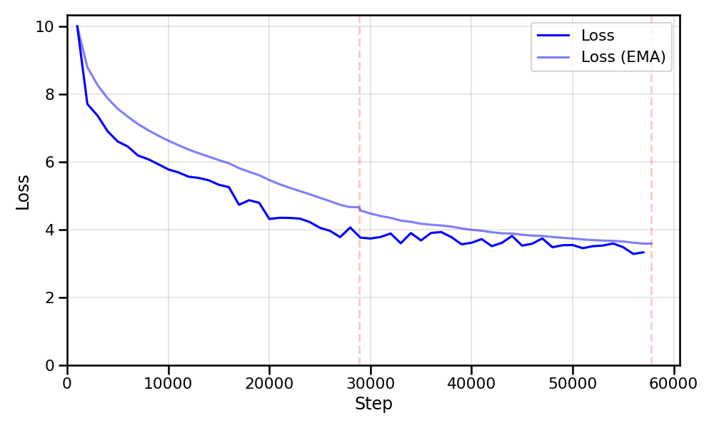
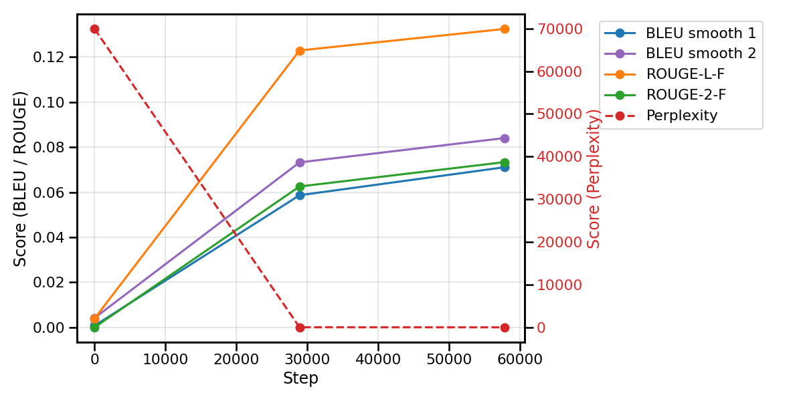

# Experimental results

This chapter presents the quantitative and qualitative evaluation of the trained Transformer model. The learning dynamics during the training phase are first examined by analyzing the loss curve. Next, the performance on the validation set is evaluated using standard translation metrics such as BLEU and ROUGE, along with the model's perplexity. Finally, a qualitative assessment is provided through concrete translation examples to highlight both the strengths and limitations of the model.

## Training Loss

The model successfully minimized the Cross Entropy loss over the course of training, which spanned approximately 57,778 steps. As indicated by the vertical red dashed lines in Figure 1, the training process was completed over two epochs.

The learning dynamic exhibits a classic two-phase pattern. During the initial rapid convergence in the first 10,000 steps, the loss drops sharply as the model rapidly learns the fundamental vocabulary and basic syntactic priors of the target language. Following this initial drop, the training enters a gradual refinement phase where the loss curve transitions into a slower, steady descent. Over the remainder of the training, the model refines its representations, with the loss eventually converging to approximately 3.5 by the end of the second epoch.

The raw loss is inherently rough and exhibits step-to-step variance due to the variability within individual mini-batches. To better visualize the underlying trajectory, an Exponential Moving Average (EMA) of the loss is superimposed on the plot. The EMA is added to reveal the overall smoothed behavior of the training.

{ loading=lazy }
/// figure-caption
Training loss over 58k steps (2 epochs). The light blue line represents the smoothed Exponential Moving Average (EMA), and the red dashed lines indicate epoch boundaries.
///

## Evaluation Metrics

Key performance metrics, including BLEU, ROUGE, and Perplexity, were evaluated every 10,000 training steps on the test data. The dataset was split into training and test sets with a 95/5 ratio; this specific allocation was chosen due to limited data availability, aiming to maximize the information provided to the model during the training phase.

### BLEU

BiLingual Evaluation Understudy (BLEU)[^1] is the standard metric for automatic evaluation of machine translation. It works by measuring precision through the calculation of $n$-gram overlap between the model's output and the human reference translation. To provide a robust score, BLEU analyzes $n$-grams of different lengths, typically from $1$ up to $4$ consecutive words, by calculating a modified $n$-gram precision $p_n$ where $n$-gram counts are capped at their maximum occurrence in any reference translation:

$$
p_n = \frac{\sum_{C \in \text{Candidates}} \sum_{n\text{-gram} \in C} \text{Count}_{\text{clip}}(n\text{-gram})}{\sum_{C' \in \text{Candidates}} \sum_{n\text{-gram}' \in C'} \text{Count}(n\text{-gram}')}
$$

In this equation, the numerator represents the total number of $n$-grams generated by the model (Candidate) that also appear in the human reference, clipped at the maximum number of times that $n$-gram occurs in the reference translation. The denominator simply represents the total number of $n$-grams produced by the model across all generated candidate translations. Thus, $p_n$ captures the proportion of the model's generated $n$-grams that are actually correct.

The metric also includes a brevity penalty $b_p$ to penalize overly short translations that might otherwise achieve high precision. This penalty is defined as:

$$
b_p = \begin{cases} 1 & \text{if } c > r \\ e^{(1-r/c)} & \text{if } c \leq r \end{cases}
$$

where $c$ is the candidate length and $r$ is the reference length. The final BLEU score is the geometric mean of the modified $n$-gram precisions, multiplied by the brevity penalty:

$$
\text{BLEU} = b_p \cdot \left( \prod_{n=1}^{N} p_n \right)^{\frac{1}{N}} = b_p \cdot \exp\left(\sum_{n=1}^{N} w_n \log p_n\right)
$$

The two sides of the formulation are mathematically equivalent specifically when the default uniform weights $w_n = 1/N$ are used. The log-space formulation on the right side of the equation is the standard approach to computing the geometric mean in order to prevent numerical underflow, which can occur when multiplying many very small probability values together. In this evaluation, $N=4$ has been chosen. The BLEU score ranges from $0$ to $1$, where 1 indicates a perfect match with the reference translation.

When calculating BLEU at the sentence level rather than at the corpus level, a structural issue arises: if a translation sequence fails to match any $n$-gram of a certain order (e.g., zero matching 4-grams), the precision $p_n$ becomes zero. Due to the geometric mean formulation in the final score calculation, a single zero precision drops the entire BLEU score to zero, heavily penalizing the sentence regardless of any valid lower-order matches. To mitigate this, sentence-level BLEU scores typically employ smoothing techniques. Chen and Cherry (2014)[^4] systematically categorized several of these methods. For instance, the technique known as Smoothing 1 replaces a zero count of matched $n$-grams with a small positive value $\epsilon$ (typically empirically determined, e.g., $\epsilon = 0.1$) for $n$-grams ranging from $1$ to $N$. Another approach, Smoothing 2, originally proposed by Lin and Och (2004), adds $1$ to both the matched $n$-gram count and the total $n$-gram count, applying this adjustment only for $n$-grams of order $n \geq 2$.

### ROUGE

Recall-Oriented Understudy for Gisting Evaluation (ROUGE)[^2] focuses on recall, measuring how much of the information present in the human reference translation was successfully captured by the model. The ROUGE-N variant computes $n$-gram recall by comparing the number of matching $n$-grams against the total number of $n$-grams in the reference:

$$\text{ROUGE-N} = \frac{\sum_{S \in \text{References}} \sum_{n\text{-gram} \in S} \text{Count}_{\text{match}}(n\text{-gram})}{\sum_{S \in \text{References}} \sum_{n\text{-gram} \in S} \text{Count}(n\text{-gram})}$$

Here, the numerator represents the total number of $n$-grams from the human reference translation that were successfully matched by the model's generated output. The denominator represents the total number of $n$-grams present across all human reference translations. Consequently, ROUGE-N captures the proportion of the original human reference that the model successfully reproduced.

To capture sentence-level structure, ROUGE-L uses the Longest Common Subsequence (LCS), which finds the longest shared sequence of words that appear in the same relative order in both the candidate $X$ and reference $Y$. The LCS-based recall is defined as:

$$R_{\text{LCS}} = \frac{\text{LCS}(X, Y)}{|Y|}$$

ROUGE is particularly useful for assessing whether the model is missing key parts of the source meaning. Like BLEU, it ranges from $0$ to $1$, with $1$ representing a complete overlap of the reference information.

### Perplexity

Perplexity measures the model's uncertainty when predicting the next token in a sequence. It is mathematically derived from the cross-entropy loss $H(P, Q)$ used during training, representing the effective size of the vocabulary the model is choosing from at each step. For a sequence of tokens, perplexity is calculated as:

$$PP(S) =  \exp(H(P, Q)) = \exp\left(-\frac{1}{N} \sum_{i=1}^{N} \log Q(x_i)\right)$$

where $P$ represents the target distribution, $Q$ is the model's predicted probability distribution over the vocabulary and $Q(x_i)$ denotes the specific probability assigned by the model to the correct token $x_i$ at position $i$ in the target sequence $S$ of length $N$.

A lower perplexity indicates that the model assigns higher probability to the correct tokens, meaning it is more confident and has learned the underlying language patterns more effectively. The perplexity value ranges from $0$ to $+\infty$, where lower values signify greater model confidence.

### Training Results

The evaluation metrics were tracked at train start and at the end of each training epoch on the test set, which comprised 5% of the total data. To ensure consistency and comparability, the metrics were configured with specific parameters: BLEU was calculated using four-gram precision (BLEU-4) with smoothing 1 and smoothing 2; ROUGE used both the longest common subsequence (ROUGE-L) and bigram overlap (ROUGE-2); Perplexity was derived directly from the crossentropy objective computed over the validation set.

The observed trajectory shows a consistent improvement across all indicators: BLEU and ROUGE scores increased steadily, while Perplexity decreased (reaching 52.1 after the first epoch and 37.3 at the end of training), reflecting the model's growing translation quality and predictive confidence as training progressed.

{ loading=lazy }
/// figure-caption
BLEU, ROUGE and Perplexity scores over training steps.
///

Although the metrics indicate clear learning progress, the absolute values of the BLEU and ROUGE scores are primarily constrained by several factors. First, the vocabulary coverage is not optimal, resulting in out-of-vocabulary problems that negatively impact both scores. Second, the model was trained on a very limited dataset consisting of 80 million tokens across 1.95 million source-target sentence pairs, whereas the original Attention Is All You Need[^1] model was trained on the WMT dataset containing 34.8 million sentence pairs. Finally, due to limited training time and computational resources, a small model configuration was employed. The proposed trained Transformer has 22.7M parameters, compared to the models trained in the original paper which ranged from 65M to 213M parameters. Translation performance could improve with more training epochs and a larger model size.

## Overall evaluation

The primary goal of this project was to successfully train a Transformer model from scratch and validate the correctness of the implementation, rather than achieving SOTA performance on translation benchmarks. The model was trained on the Europarl corpus, which is predominantly composed of political and institutional sentences. As a result, it performs well on in-domain sentences drawn from European Parliament proceedings. When translating text from other domains its limitations become more apparent: specialized vocabulary or informal phrasing can lead to unknown tokens (OOV problem), and the mismatch with the training distribution may produce less fluent or semantically imprecise translations.

Sample 1:

<blockquote>
  EN:
  
    I must say that many of the guidelines and measures we advocate in this report would not have any effect and would be inefficient if they were not adopted by the various ACP actors, and especially by civil society in the ACP states, as civil society is the ultimate beneficiary of such measures.
  
     
  IT:
  
    devo dire che molti degli orientamenti e delle misure che sosteniamo in questa relazione non avrebbero alcun effetto e sarebbe inefficiente se non fossero adottati dai vari attori acp , e soprattutto dalla società civile degli stati acp , in quanto la società civile è il beneficiario finale di tali misure .
  
</blockquote>

Sample 2:

<blockquote>
  EN:
  
    I would also add that the Union must remain vigilant and must adopt exemplary sanctions to deal with some of the problems we must address. One such problem is corruption where, for example, infringements involve natural or legal persons or European companies.
  
     
  IT:
  
    aggiungerei inoltre che l' unione deve rimanere vigile e deve adottare sanzioni esemplari per affrontare alcuni dei problemi che dobbiamo affrontare : un problema che è la corruzione dove , ad esempio , le violazioni comportano violazioni di persone naturali o giuridiche o società europee .
  
</blockquote>

Sample 3:

<blockquote>
  EN:
  
    As one of the most brilliant European thinkers of the end of this century said, corruption is the cancer that corrodes democracy.
  
     
  IT:
  
    come uno dei grandi &lt;UNK&gt; europei della fine di questo secolo , la corruzione è il cancro che la democrazia &lt;UNK&gt; .
  
</blockquote>

Sample 4:

<blockquote>
  EN:
  
    The early bird catches the worm.
  
     
  IT:
  
    le catture &lt;UNK&gt; &lt;UNK&gt; &lt;UNK&gt; .
  
</blockquote>

[^1]: Papineni, Kishore, Salim Roukos, Todd Ward, and Wei-Jing Zhu. 2002. *BLEU: a Method for Automatic Evaluation of Machine Translation*. <https://aclanthology.org/P02-1040/>.

[^2]: Lin, Chin-Yew. 2004. *ROUGE: A Package for Automatic Evaluation of Summaries*. <https://aclanthology.org/W04-1013/>.

[^3]: Post, Matt. 2018. *A Call for Clarity in Reporting BLEU Scores*. <https://aclanthology.org/W18-6319.pdf>.

[^4]: Chen, Boxing, and Colin Cherry. 2014. *A Systematic Comparison of Smoothing Techniques for Sentence-Level BLEU*. <https://aclanthology.org/W14-3346.pdf>.

[^5]: Vaswani, A., Shazeer, N., Parmar, N., Uszkoreit, J., Jones, L., Gomez, A., Kaiser, L. \& Polosukhin, I. Attention Is All You Need.  (2017), <https://arxiv.org/abs/1706.03762>
