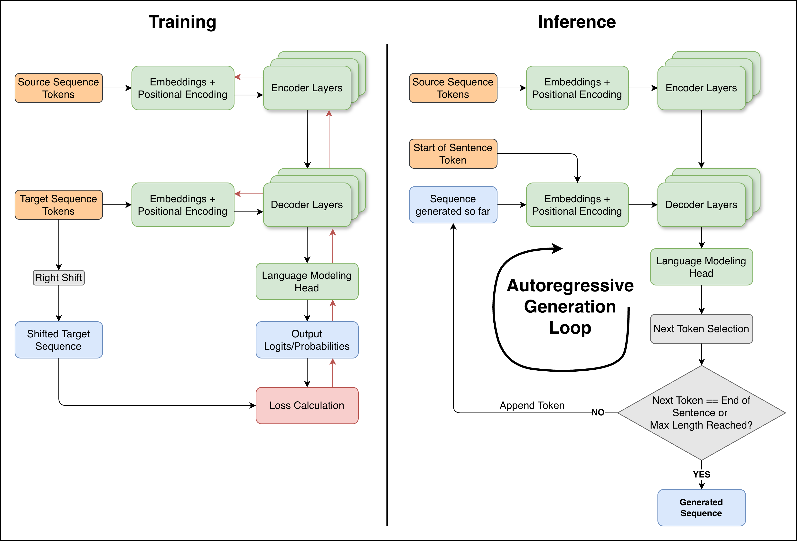

# The Transformer training/inference logic

> **Disclaimer**
>
> This Transformer implementation misses a lot of architectural improvements that have been developed since the first paper release in 2017. It's main purpose is to show off the architecture design and training/inference methods as a learning project.

This document serves as the second step in understanding the whole implementation, detailing how the architecture is employed during training and how it is utilized for sequence to sequence generation during inference.

While the architecture provides the capacity for learning, the training regime and decoding strategies are what enable the model to achieve high performance on specific tasks like Machine Translation.

{ loading=lazy }
/// figure-caption
Left: Training flow. Right: Inference flow. Green blocks represent trainable modules, Orange blocks represent input modules, Light Blue modules represent non trainable tensors and Grey blocks represent hardcoded operations. Black arrows show forward passes and simple input/output connections while red ones show backward passes.
///

This document is organized to provide a detailed walkthrough of the training and inference logic:

-   **The Training Logic**: Details the learning objectives, optimization strategies including various learning rate schedulers, and regularization techniques.
-   **Experimental Results**: Presents the training outcomes, evaluating the model through standard metrics.
-   **The Inference Logic**: Explains the autoregressive generation process and the implementation of decoding strategies used to produce translations.
-   **Conclusions**: Summarizes implementation challenges, learned lessons, and discusses modern paradigms in training and inference.
