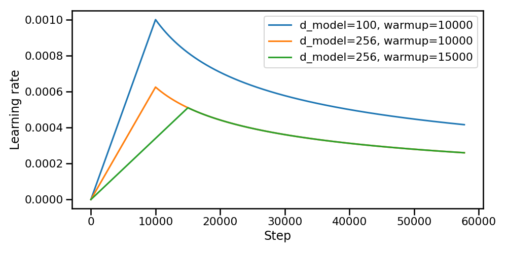
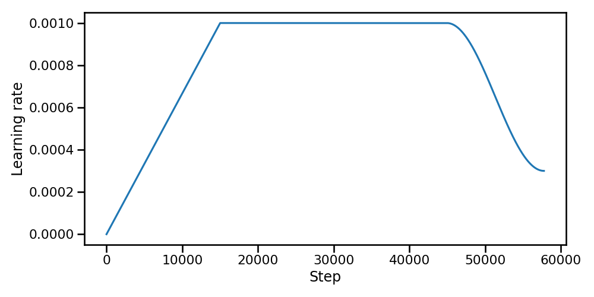
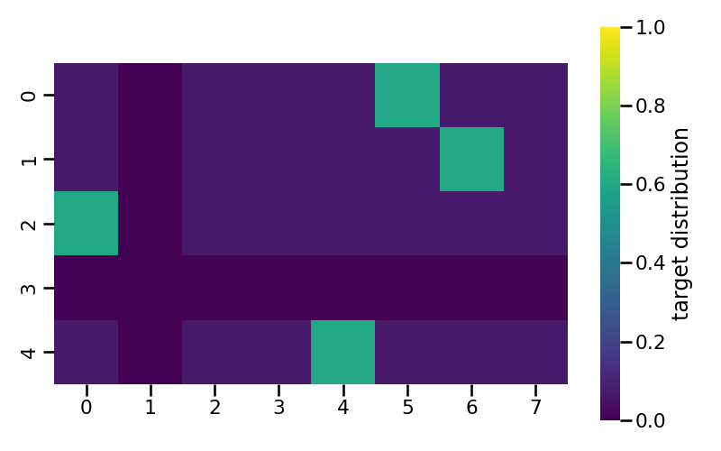

# The Transformer training logic

This section covers the training procedure used to train the Transformer model for the English-to-Italian machine translation task. Beyond the encoder-decoder architecture, there are several important techniques that help in making the model converge and achieving good results for text generation.

## Learning objective and loss calculation

The training task for the model is **Next Token Prediction**. Given a sequence of tokens $x_1, ..., x_{t-1}$, the model learns to predict the next token $x_t$. This is an **autoregressive task** where the joint probability of the sequence is decomposed into conditional probabilities:

$$
P(\bold{x}) = \prod_t P(x_t | x_0, x_1, \dots, x_{t-1} ) = \prod_t P(x_t | x_{<t})
$$

The training process leverages **Teacher Forcing**, a technique where the model is provided with the ground truth sequence as history at each position. This means that to predict the token at position $t$, the model uses the actual tokens from the training data for all positions $<t$, rather than relying on its own previous and potentially incorrect predictions. In practice, this is implemented by shifting the target sequence by one position: given a target sequence $y = (y_1, y_2, \dots, y_T)$, the decoder input is $y_{<T} = (y_1, \dots, y_{T-1})$ and the ground truth sequence is $y_{>1} = (y_2, \dots, y_T)$. At each position $t$, the decoder conditions on the ground truth prefix $y_1, \dots, y_{t-1}$ to predict $y_t$.

To train the model, this is treated as a classification problem at each position, where the classes are the words in the vocabulary. The objective is to minimize the difference between the predicted probability distribution and the true distribution (More on [Label Smoothing](training.md#label-smoothing) about the true distribution).

Mathematically, minimizing the Cross Entropy loss is equivalent to minimizing the Kullback-Leibler (KL) Divergence between the true distribution $P$ and the predicted distribution $Q$.

$$
H(P,Q) = H(P) + D_{KL}(P||Q)
$$

where $H(P,Q)$ is the crossentropy between $P$ and $Q$, $H(P)$ is the entropy of $P$, and $D_{KL}(P||Q)$ is the KL divergence between the two.

Since $H(P)$ depends only on the target and is constant with respect to the model parameters $\theta$, minimizing the Cross Entropy is equivalent to minimizing the KL divergence:

$$
\nabla_\theta H(P,Q) \ = \ \nabla_\theta [ H(P) + D_{KL}(P||Q) ] \ = \ \underbrace{\nabla_\theta H(P)}_{0} + \nabla_\theta D_{KL}(P||Q)
$$

So, both loss functions can be employed to train the model.

At each training iteration, the per-token losses are first summed across both the batch and the sequence length dimensions, producing a single scalar that aggregates contributions from every position in every sentence. This total is then normalized by dividing by the number of non-padding target tokens in the batch, rather than by the batch size. Since batches may contain sequences of varying lengths, normalizing by the raw token count ensures that each meaningful token contributes equally to the gradient update, preventing longer sequences from dominating the loss due to having more tokens.

## Learning rate scheduling

Learning rate scheduling is a technique used to adjust the step size during training, moving away from a constant value to a predefined path that enhances both speed and stability. For complex architectures like the Transformer, this process is essential for navigating the loss landscape effectively. Managing the learning rate involves balancing three interrelated aspects[^1]:

- **Magnitude**: the learning rate must be carefully chosen relative to the problem's condition number, i.e., the ratio of sensitivity between the most and least responsive directions in the parameter space. If the rate is too large, optimization diverges; if it is too small, training either takes too long or converges to a suboptimal solution.
- **Decay rate:** a fixed learning rate may cause the model to bounce around the minimum without settling into it. While $\mathcal{O}(t^{-1/2})$ decay is optimal for smooth, convex problems, deep networks require a gentler schedule to navigate their rugged, non-convex loss landscapes. Decaying too aggressively can cause the optimizer to freeze in a suboptimal region or local minimum before it has had the chance to escape. A slower decay preserves the model's ability to explore the landscape and find better solutions before finally converging.

- **Initialization dynamics**: the initial update directions are essentially meaningless because the parameters start from random values. Taking large steps in these arbitrary directions can be counterproductive, making a controlled warmup phase necessary.

A crucial component of this schedule is the **warmup phase**, where the learning rate gradually increases from zero to a peak value. This is necessary because initial gradients can be highly unstable; starting with a large step size often leads to "catastrophic divergence" where the model fails to learn anything useful.

Once the model has stabilized and reached its peak learning rate, the schedule typically transitions into a **decay phase**. As training progresses and the model nears an optimal solution, a high learning rate can cause it to oscillate around or even overshoot the minimum. Reducing the step size allows for finer, more precise adjustments, which helps the model settle into a deeper region of the loss landscape.

This implementation supports two main scheduling strategies: the original schedule proposed in the "Attention Is All You Need"[^2] paper and a more modern Warmup-Stable-Decay (WSD) approach[^3].

### Original scheduling

The original paper[^2] proposes a schedule governed by a single compact expression:

$$
\eta(t) = d_{\text{model}}^{-0.5} \cdot \min\!\left(t^{-0.5},\; t \cdot \text{warmup\_steps}^{-1.5}\right)
$$

The transition between the two regimes occurs exactly at $t = \text{warmup\_steps}$, where both terms evaluate to $\text{warmup\_steps}^{-0.5}$ and the peak learning rate is therefore:

$$
\eta_{\text{peak}} = d_{\text{model}}^{-0.5} \cdot \text{warmup\_steps}^{-0.5}
$$

The prefactor $d_{\text{model}}^{-0.5}$ couples the learning rate directly to the model's embedding dimension. Since wider models distribute the gradient signal more for each parameter, a smaller step size is required to keep the effective update magnitude stable. This coupling eliminates the need to manually retune the learning rate when scaling the model width.

A notable property of this schedule is that neither a minimum nor a maximum learning rate is specified as a hyperparameter: both are implicitly determined by $d_{\text{model}}$ and $\text{warmup\_steps}$. This reduces the search space to a single tunable quantity, the warmup duration, at the cost of less flexibility in shaping the curve independently from the model size.

{ loading=lazy}
/// figure-caption
Learning rate scheduling from the original paper[^2].
///

### Warmup-Stable-Decay scheduling

Following the DeepSeek V3[^3] approach, this scheduler consists of three distinct phases:

1. **Warmup**: The learning rate increases linearly from 0 to its peak value over a designated number of iterations.
2. **Stable**: The peak learning rate is maintained for a duration defined by the stable iterations proportion.
3. **Decay**: A cosine decay is applied, reducing the learning rate from its peak value to a specified minimum over the remaining iterations.

The complete schedule can be described by the following piecewise function:

$$
\eta(t)= \left\{\begin{array}{cc}
    \dfrac{ws}{lr_1}t &t < ws, \\[10pt]
    lr_1 &ws \le t < ws + ss, \\[5pt]
    lr_0 + \frac{1}{2} \left(lr_1 - lr_0\right)  \left(1 + \cos\left(\dfrac{\pi}{ds} t\right)\right) & \text{otherwise}
\end{array}\right.
$$

where $lr_0$ is the minimum learning rate, $lr_1$ is the peak learning rate, $ws$ is the number of warmup iterations, $ss$ is the number of stable iterations, and $ds$ is the number of decay iterations.

{ loading=lazy}
/// figure-caption
Warmup-Stable-Decay scheduling[^3].
///

Compared to the original schedule, WSD offers greater flexibility at the cost of a larger hyperparameter space. The original schedule couples the learning rate to $d_{\text{model}}$, automatically scaling the peak value with the model width and leaving only the warmup duration as a free parameter; however, the inverse-square-root decay it uses is monotonic and cannot be independently shaped. WSD, by contrast, decouples the learning rate from the model dimension and exposes the peak and minimum learning rates, and the relative lengths of all three phases as explicit hyperparameters. This makes WSD more adaptable to different training budgets: the stable phase allows the model to train at peak capacity for as long as needed, while the cosine decay provides a smoother transition to convergence than the slower, unbounded $t^{-0.5}$ tail of the original schedule.

Wen et al.[^5] show that during the stable phase, the high learning rate drives fast optimization progress but also induces oscillations due to gradient stochasticity. Since these oscillations scale linearly with the learning rate, the decay phase rapidly suppresses them, revealing the true underlying progress.

## Regularization techniques

The Transformer employs two forms of regularization to prevent overfitting: dropout and label smoothing.

### Dropout

**Dropout**[^4] is a regularization technique that randomly sets a fraction $p$ of neuron activations to zero during each forward pass. This prevents co-adaptation of neurons: since any neuron can be dropped at random, neurons cannot rely on the presence of specific other neurons and are forced to learn more robust, independently useful features. Training with dropout is equivalent to training an exponentially large ensemble of sub-networks that share weights; at test time, the full network approximates the average of all these sub-networks.

The Transformer is particularly susceptible to overfitting due to its large parameter count and the self attention mechanism's capacity to memorize specific token co-occurrence patterns. The original paper[^2] applies dropout with probability 0.1 at three specific locations:

- **After attention weights** (before multiplying with values): dropout randomly zeroes out some attention weights after the softmax, preventing the model from concentrating all attention on a few positions and encouraging more distributed attention patterns.
- **After each sub-layer output** (before the residual connection): applied to the output of each sub-layer (self attention, cross attention, feed forward) before adding the residual connection and applying layer normalization. This regularizes the transformation learned by each sub-layer, preventing any single sub-layer from becoming too dominant.
- **After embeddings and positional encodings**: applied in both the encoder and decoder stacks to the sum of token embeddings and sinusoidal positional encodings. This adds noise to the input representation, acting as a form of data augmentation at the representation level.

### Label Smoothing

Label Smoothing[^2] is a regularization technique that softens the hard one-hot target distribution used during training, preventing the model from becoming overconfident in its predictions. Instead of assigning probability $1$ to the correct token and $0$ to all others, a small amount of probability mass $\epsilon$ is redistributed uniformly across the entire vocabulary:

$$
\text{smoothed\_target} = (1 - \epsilon) \cdot \text{one\_hot\_target} + \frac{\epsilon}{\text{vocab\_size}}
$$

{ loading=lazy .img-medium}
/// figure-caption
Label Smoothing target distribution matrix with $\epsilon = 0.4$, vocab size = 8, samples = 5, padding index = 1.
///

Figure 3 visualises the smoothed target distribution for a batch of 5 training examples over a vocabulary of 8 tokens, where token index 1 is the padding token. Two special rules govern the construction of each row. When the true token to be predicted is itself the padding token (row 3), the prediction is entirely disabled: the model should not learn any distribution for this position, so the entire row is set to zero. In every other row, the padding token never receives any probability mass: rather than spreading $\epsilon$ uniformly across all 8 vocabulary entries, the smoothed probability is redistributed only over the $V - 1 = 7$ non-padding tokens, which is reflected by column 1 remaining equal to zero for all rows.

For the remaining rows (0, 1, 2, 4), each smoothed distribution assigns a probability of $1 - \epsilon$ to the correct token and distributes the remaining probability mass $\epsilon$ uniformly over the non-padding vocabulary entries.

From a training dynamics perspective, the two most notable effects of label smoothing both trace back to the same mechanism: penalising overconfidence. By construction, a perfectly confident prediction incurs a non-zero loss against the smoothed target, which forces the model to spread some probability mass across the vocabulary rather than concentrating it entirely on one token. This has a direct cost on perplexity, since the raw likelihood assigned to the ground-truth sequence is systematically lower; however, the same redistribution of mass encourages the model to maintain a more balanced distribution over plausible continuations, which leads to better surface-form outputs and, consequently, higher BLEU scores. In other words, the regularisation that hurts perplexity is precisely what improves translation quality.

## Gradient norm clipping

Gradient norm clipping is a technique used to prevent the **exploding gradient** problem, which is common in deep neural networks. If the error landscape has steep cliffs (high curvature), the gradients can become excessively large. A gradient descent step based on such a large gradient can throw the parameters far away from the optimal region, potentially causing the loss to increase dramatically or overflow to NaN.

Consider an example where the gradient is unbalanced: suppose the gradient is extremely large in one direction but reasonable in others. Without clipping, the update step will be dominated by this single direction. This large step might overshoot the minimum in that specific direction, but more importantly, it scales the entire update vector. This means the parameters will also take a huge, likely incorrect, step in all other directions, disrupting the learning process for features that were otherwise training stably. Clipping the global norm of the gradient vector ensures that the step size remains within a reasonable range, preserving the direction of the update while limiting its magnitude.

Here follows the mathematical formulation of clipping the gradient norm at $K$ as maximum value:

$$
\mathbf{g} \leftarrow \begin{cases}
\mathbf{g} & \text{if } \|\mathbf{g}\| \leq K \\
K \cdot \frac{\mathbf{g}}{\|\mathbf{g}\|} & \text{if } \|\mathbf{g}\| > K
\end{cases}
$$

[^1]: Zhang, Aston and Lipton, Zachary C. and Li, Mu and Smola, Alexander J. 2023. *Dive into Deep Learning*. <https://d2l.ai/index.html>.

[^2]: Vaswani, Ashish, Noam Shazeer, Niki Parmar, et al. 2017. *Attention Is All You Need*. <https://arxiv.org/abs/1706.03762>.

[^3]: DeepSeek-AI. 2024. *DeepSeek-V3 Technical Report*. <https://arxiv.org/abs/2412.19437>.

[^4]: Srivastava, Nitish, Hinton, Geoffrey, et al. 2014. *Dropout: A Simple Way to Prevent Neural Networks from Overfitting*. <http://jmlr.org/papers/v15/srivastava14a.html>

[^5]: Wen, Kaiyue, Tengyu Ma, and Zhiyuan Li. 2025. *Understanding Warmup-Stable-Decay Learning Rates: A River Valley Loss Landscape Perspective*. Published as a conference paper at ICLR 2025.
